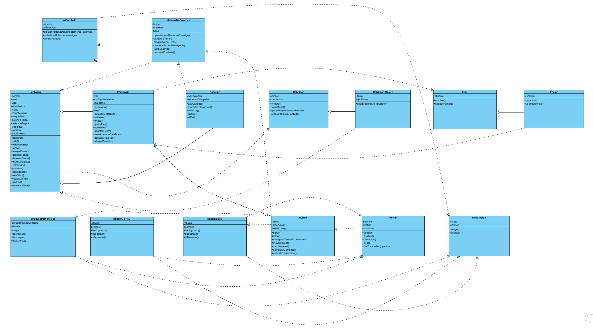
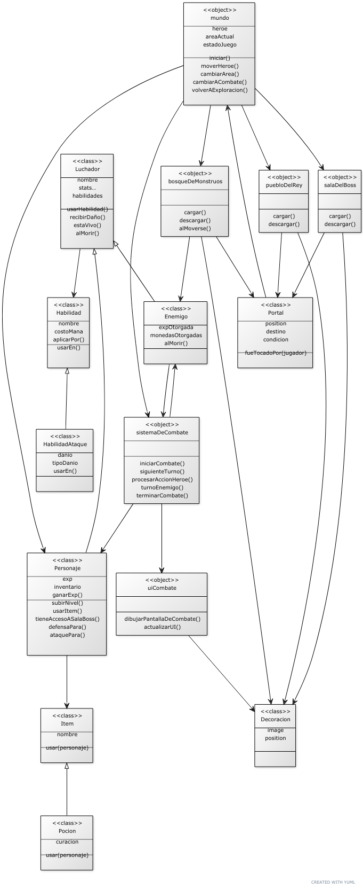

UTN - Facultad Regional Buenos Aires - Materia Paradigmas de Programación

## Equipo de desarrollo:

- Lucas Almiron
- Federico Bremberg
- David Fuertes Mamani
- Franco Marcolin

## Introducción

- Nuestro juego se trata de un juego RPG de combate, donde hay diversas areas, 3 en total, en las que nuestro personaje elegido puede transitar. El objetivo de nuestro protagonista es llegar al nivel 3, donde se encuentra la Boss Fight final, y si gana, finaliza exitosamente el juego. 

## Capturas

- Completar

## Reglas de Juego / Instrucciones

### Instrucciones del juego

- Completar

### Controles:

- Completar

## Explicaciones teóricas y diagramas

